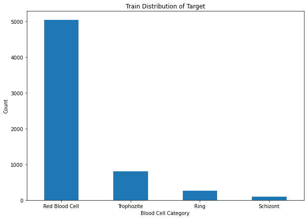
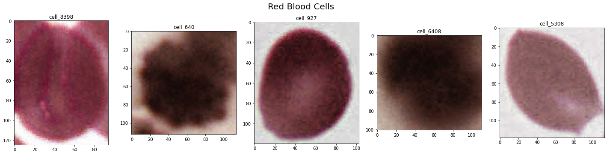
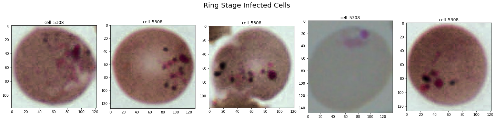
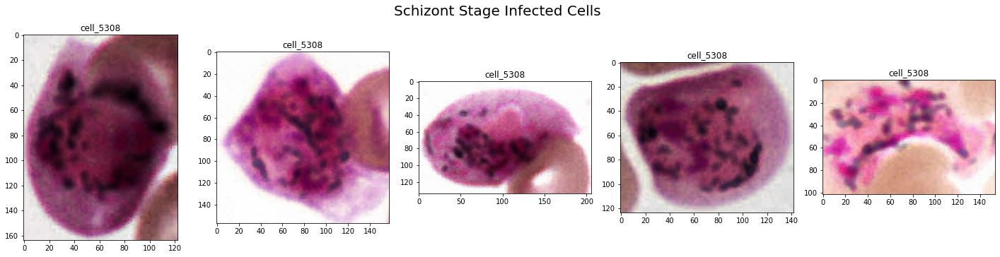
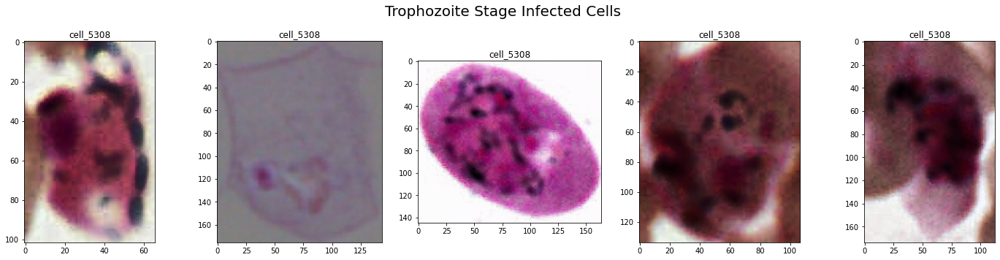

# Red Blood Cell Classification

Sheldon Sebastian

Photo by <a href="https://unsplash.com/@switch_dtp_fotografie?utm_source=unsplash&utm_medium=referral&utm_content=creditCopyText">Lucas van Oort</a> on <a href="https://unsplash.com/s/photos/mosquito?utm_source=unsplash&utm_medium=referral&utm_content=creditCopyText">Unsplash</a>

## Abstract

 

The goal of this project is to identify whether a red blood cell is healthy or infected with any of the following stages of malaria: ring, schizont and trophozoite using a Multi-Layer Perceptron (MLP). Custom MLP was created and hyper-parameter tuning was performed on it using manual search, random grid search and automatic hyper-parameter tuning using Optuna.  

 
<i>Keywords</i>: Computer Vision, Deep Learning, Image Classification, Multi Layer Perceptron

## Table of Contents:

- Introduction
- Dataset Description and Data Preprocessing	
- Exploratory Data Analysis
- Modeling
    - MLP using manual hyper-parameter tuning
    - MLP using random grid search hyper-parameter tuning
    - MLP using automatic hyper-parameter tuning using Optuna
- Results & Analysis	
- Conclusion
- Future Work	
- References

## Introduction

Malaria is a mosquito-borne disease caused by a parasite. About 2,000 cases of malaria are diagnosed in the United States each year.[1] People with malaria often experience fever, chills, and flu-like illness. Left untreated, they may develop severe complications and die. For this project a Multi-Layer Perceptron (MLP) was used to classify blood cells into 4 different categories: red blood cell, ring, schizont and trophozoite. An image labelled as red blood cell is healthy and the rest of the labels indicate some stage of malaria infection. A custom MLP architecture was constructed and hyper-parameter tuning was performed manually, using random-grid search and automatically using Optuna[2].   If a model can successfully identify these types of cells from images taken with a microscope, this would allow to automate a very time-consuming testing process, leaving human doctors with more time to treat the actual disease. Furthermore, an early malaria detection can save lives!   

## Dataset Description and Data Preprocessing

The dataset was provided by <a href="https://www.linkedin.com/in/amir-jafari-phd-5a153863/">Dr. Amir Jafari</a> and is available <a href = "https://github.com/sheldonsebastian/Red-Blood-Cell-Classification/tree/main/input/train">here</a>. The dataset contains 8,607 unique png files, and their corresponding labels in txt files. The images have original dimension of 100x100 pixels, and the different categories for labels are red blood cell, ring, schizont and trophozoite.     The data was preprocessed by creating a csv file containing unique image id and the  encoded categorical target. The encoded categorical targets are as follows: 'red blood cell'=0, 'ring'=1, 'schizont'=2, 'trophozoite'=3. The original data was stratified split into 90-10% train-holdout and the train data was additionally split into 80-20% train-validation set. Hence the training set contains 6196 images, validation set contains 1550 images and holdout set contains 861 images.   

## Exploratory Data Analysis

The exploratory data analysis jupyter notebook can be found <a href = "https://github.com/sheldonsebastian/Red-Blood-Cell-Classification/blob/main/src/1_eda.ipynb">here</a>. The distribution of the different categories can be seen in the below figure:

We see that the distribution of data is <i>severely imbalanced</i>, thus to evaluate our model accuracy is not the best metric. Instead we use <b>average of the macro-averaged F1-score and the Cohen’s Kappa score</b> for model evaluation.

 

A few example images for healthy red blood cells are shown:

 

A few example images for ring infected cells are shown:

 

A few example images for schizont infected cells are shown:

 

A few example images for trophozite infected cells are shown:

## Modeling

After the data was split into train-validation-holdout, MLP model was created and hyper-parameter tuning was performed using manual search, random grid search and automatically using Optuna.   Since the data was severely imbalanced the model evaluation metric was average of the macro-averaged F1-score[3] and the Cohen’s Kappa score[4]. To handle class imbalance all the three approaches (manual, random-grid, optuna) used class weights inversely proportional to their occurrence frequency.    A custom keras image generator[5] was used to read the images and labels. The generator performed random brightness and flip augmentation on training images to prevent model overfitting using albumentations[6] package. The image generator read the png files using OpenCV[7], performed augmentations for training data, normalized the image by dividing by 255 and finally convert to numpy array.       

### MLP using manual hyper-parameter tuning:

The code for manual MLP can be found <a href="https://github.com/sheldonsebastian/Red-Blood-Cell-Classification/blob/main/src/model_trainers/0_manual.py">here</a> and model architecture can be found <a href="https://github.com/sheldonsebastian/Red-Blood-Cell-Classification/blob/1213635ec4cea020a2adc34459ad9911b88d43bc/src/model_trainers/model_dispatcher.py#L8">here</a>. The model uses 3 layers of 512 neurons each and contains BatchNormalization for faster convergence and Dropout to avoid dead neurons. The activation function used in each layer was 'relu' and final layer had softmax for classifying images into 4 categories. The loss used was 'sparse categorical cross entropy' and optimizer used was Adam with learning rate of 0.00001. To avoid long training time, early stopping callbacks from keras was used along with model checkpoints to save best model based on validation data. The model was trained for 5000 epochs with batch size of 1024.   A summary of the model and training is shown in below table:

| Attribute | Value |
| ---------| -----------|
| Number of hidden layers| 3 |
| Number of neurons per layer| 512 |
| Activation Function| relu |
| Loss| sparse categorical cross entropy |
| Optimizer | Adam |
| Learning Rate | 0.00001 |
| Epochs | 5000 |
| Batch Size | 1024 |
| Early Stopping, Batch Normalization, Dropout, Model Checkpoint | Yes |

### MLP using random grid search hyper-parameter tuning:

The code for random grid search MLP can be found <a href="https://github.com/sheldonsebastian/Red-Blood-Cell-Classification/blob/main/src/model_trainers/1_random_search.py">here</a> and model architecture can be found <a href="https://github.com/sheldonsebastian/Red-Blood-Cell-Classification/blob/9dd3e0afe27e0693bffe3035eb8e3c81fee1b0b1/src/model_trainers/model_dispatcher.py#L31">here</a>. To perform random grid search for the keras model, it was wrapped in a scikit layer using KerasClassifier[8].   The evaluation metric used was average of F1 score and Cohen Kappa's score and the code for that can be found <a href="https://github.com/sheldonsebastian/Red-Blood-Cell-Classification/blob/9dd3e0afe27e0693bffe3035eb8e3c81fee1b0b1/src/common/utilities.py#L8">here</a>. Since we are performing random grid search, we used <a href="https://github.com/sheldonsebastian/Red-Blood-Cell-Classification/blob/9dd3e0afe27e0693bffe3035eb8e3c81fee1b0b1/src/common/utilities.py#L16">predefined split</a> to prevents data leakage among multiple runs. A summary of the model and training is shown in below table:

| Attribute | Value |
| ---------| -----------|
| Number of hidden layers| 1,2,3,4,5 |
| Number of neurons per layer| Between 1 and 2048 |
| Activation Function| relu, selu, elu |
| Loss| sparse categorical cross entropy |
| Optimizer | Adam |
| Learning Rate | Random 1000 numbers between reciprocal of 3e-4 to 3e-2 |
|Dropout probability| 0.0, 0.1, 0.2, 0.3, 0.4, 0.5 |
|Batch Size| 32, 64, 128, 256, 512, 1024 |
|Epochs| 300, 600, 1000 |
|Iterations| 25 |

The best parameters found were:

| Attribute | Value |
| ---------| -----------|
| Number of hidden layers| 5 |
| Number of neurons per layer| 658 |
| Activation Function| elu |
| Loss| sparse categorical cross entropy |
| Optimizer | Adam |
| Learning Rate | 0.0108 |
|Dropout probability| 0.5 |
|Batch Size| 64 |
|Epochs| 1000 |

### MLP using automatic hyper-parameter tuning using Optuna:

## Results & Analysis

...

## Conclusion

...

## Future Work

...

## References
1. https://www.cdc.gov/parasites/malaria/index.html
2. https://optuna.org/
3. https://scikit-learn.org/stable/modules/generated/sklearn.metrics.f1_score.html
4. https://scikit-learn.org/stable/modules/generated/sklearn.metrics.cohen_kappa_score.html
5. https://stanford.edu/~shervine/blog/keras-how-to-generate-data-on-the-fly
6. https://albumentations.ai/
7. https://opencv.org/
8. https://www.tensorflow.org/api_docs/python/tf/keras/wrappers/scikit_learn/KerasClassifier
9. 