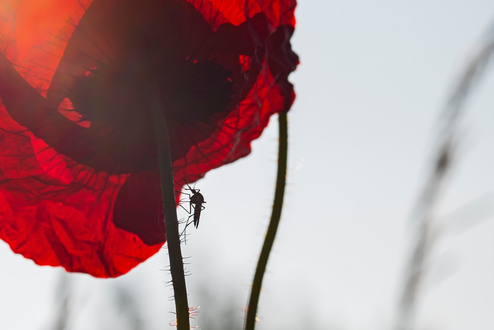

# Red Blood Cell Classification

Sheldon Sebastian

Photo by <a href="https://unsplash.com/@switch_dtp_fotografie?utm_source=unsplash&utm_medium=referral&utm_content=creditCopyText">Lucas van Oort</a> on <a href="https://unsplash.com/s/photos/mosquito?utm_source=unsplash&utm_medium=referral&utm_content=creditCopyText">Unsplash</a>

Image Classification problem to identify Red Blood Cells are infected with Malaria or not
